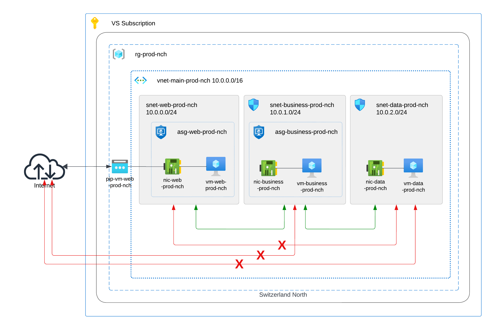

# Open Session 1

### Description 
Network Security Groups and Application Security Groups for a 3-Tier architecture design. 
### Architecture 
 
### Local deployment 
#### Requirements 
- Azure CLI 
- Git 
- Terraform 
#### Azure resources needed in advance 
- Azure Subscription 
- Resource group for Storage Account 
- Storage Account and Container to save tfstate file 
#### Steps for Unix systems 
 1. Connect to your Azure account  
 `az login -u <username> -p <password>` 
 
 2. Clone this repository in your local machine  
 `git clone <HTTPS/SSH>` 
 
 3. Go to the repository folder  
 `cd az-terratest` 
 
 4. Go to infrastructure folder  
 `cd infrastructure` 
 
 5. Initialize terraform  
 `terraform init` 
 
 6. Run terraform plan  
 `terraform plan` 
 
 7. Deploy resources in Azure  
 `terraform apply` 

<!-- BEGIN_TF_DOCS -->
### Requirements

| Name | Version |
|------|---------|
|  [terraform](#requirement\_terraform) | >= 1.4.6 |
|  [azurerm](#requirement\_azurerm) | >=2.29.0 |

### Providers

| Name | Version |
|------|---------|
|  [azurerm](#provider\_azurerm) | 3.73.0 |

### Modules

No modules.

### Resources

| Name | Type |
|------|------|
| [azurerm_application_security_group.asg](https://registry.terraform.io/providers/hashicorp/azurerm/latest/docs/resources/application_security_group) | resource |
| [azurerm_linux_virtual_machine.vm](https://registry.terraform.io/providers/hashicorp/azurerm/latest/docs/resources/linux_virtual_machine) | resource |
| [azurerm_network_interface.nic](https://registry.terraform.io/providers/hashicorp/azurerm/latest/docs/resources/network_interface) | resource |
| [azurerm_network_interface_application_security_group_association.asg_nic_assoc](https://registry.terraform.io/providers/hashicorp/azurerm/latest/docs/resources/network_interface_application_security_group_association) | resource |
| [azurerm_network_security_group.nsg](https://registry.terraform.io/providers/hashicorp/azurerm/latest/docs/resources/network_security_group) | resource |
| [azurerm_public_ip.pip](https://registry.terraform.io/providers/hashicorp/azurerm/latest/docs/resources/public_ip) | resource |
| [azurerm_resource_group.rg](https://registry.terraform.io/providers/hashicorp/azurerm/latest/docs/resources/resource_group) | resource |
| [azurerm_subnet.snet](https://registry.terraform.io/providers/hashicorp/azurerm/latest/docs/resources/subnet) | resource |
| [azurerm_subnet_network_security_group_association.nsg_snet_assoc](https://registry.terraform.io/providers/hashicorp/azurerm/latest/docs/resources/subnet_network_security_group_association) | resource |
| [azurerm_virtual_network.vnet](https://registry.terraform.io/providers/hashicorp/azurerm/latest/docs/resources/virtual_network) | resource |
| [azurerm_key_vault.example](https://registry.terraform.io/providers/hashicorp/azurerm/latest/docs/data-sources/key_vault) | data source |
| [azurerm_key_vault_secret.secret_vm_pwd](https://registry.terraform.io/providers/hashicorp/azurerm/latest/docs/data-sources/key_vault_secret) | data source |
| [azurerm_key_vault_secret.secret_vm_user](https://registry.terraform.io/providers/hashicorp/azurerm/latest/docs/data-sources/key_vault_secret) | data source |

### Inputs

| Name | Description | Type | Default | Required |
|------|-------------|------|---------|:--------:|
|  [my\_ip](#input\_my\_ip) | IP for ssh | `string` | n/a | yes |

### Outputs

| Name | Description |
|------|-------------|
|  [pip\_address\_web](#output\_pip\_address\_web) | n/a |
<!-- END_TF_DOCS -->